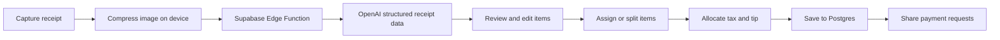

<div align="center">
  

  # Divi

  **Scan the receipt. Split the bill. Settle up.**

  Divi is a mobile bill-splitting app that turns a receipt photo into an editable, itemized split. Assign items to friends, divide shared dishes down to the cent, distribute tax and tip, and send payment requests—all from one flow.

  
  
  
  
</div>

> [!NOTE]
> Divi uses native modules and requires an Expo development build. It does not run in Expo Go.

## What Divi does

- **Scans receipts with AI** — captures a receipt, compresses it on-device, and extracts line items, tax, tip, and totals with OpenAI vision.
- **Keeps every split editable** — rename, add, remove, or divide items before assigning them.
- **Splits accurately** — shared items preserve the exact subtotal down to the cent; tax is proportional and tip is divided evenly.
- **Works with your contacts** — choose people from the device address book or add them manually.
- **Sends payment requests** — share a personalized summary and payment link through SMS, with Venmo, Cash App, and Zelle support.
- **Tracks what is owed** — save receipts, revisit past splits, and mark payment requests as settled.
- **Includes an AI assistant** — use plain language to assign or move items and adjust a split.

## How it works



Receipt images are resized and compressed before upload. The OCR function returns structured JSON, and the client filters and validates the result before the user reviews it. Final receipts, assignments, contacts, and payment statuses are stored in Supabase under row-level security policies.

## Tech stack

| Area | Technology |
| --- | --- |
| Mobile app | React Native, Expo 55, Expo Router |
| Language | TypeScript |
| State | Zustand and React Context |
| Backend | Supabase Edge Functions on Deno |
| Database and auth | Supabase Postgres and Supabase Auth |
| AI | OpenAI vision, chat, and transcription APIs |
| Payments | Shareable requests with Venmo, Cash App, and Zelle links |
| Subscriptions | RevenueCat |
| Monitoring | Sentry |
| Testing | Jest and a Node-based OCR integration suite |

## Repository layout

```text
divi-split/
├── frontend/                 # Expo / React Native application
│   ├── app/                  # File-based routes and screens
│   ├── components/           # Shared UI components
│   ├── stores/               # Zustand receipt and split state
│   ├── styles/               # Design tokens
│   └── utils/                # OCR, contexts, math, and notifications
├── supabase/
│   ├── functions/            # OCR, AI assistant, pay, and account functions
│   └── migrations/           # Postgres schema, RPCs, and RLS policies
├── netlify/                  # Public payment and support pages
├── tests/                    # OCR integration fixtures and scripts
└── docs/                     # Privacy-policy source and generated document
```

## Getting started

### Prerequisites

- Node.js and npm
- Xcode with CocoaPods for iOS, or Android Studio for Android
- Docker and the Supabase CLI for a fully local backend
- An OpenAI API key for OCR and assistant functions

### 1. Install the app

```bash
git clone https://github.com/s0hinyea/divi-split.git
cd divi-split/frontend
npm ci
```

### 2. Configure the frontend

Create `frontend/.env`:

```dotenv
# Required
EXPO_PUBLIC_SUPABASE_URL=http://127.0.0.1:54321
EXPO_PUBLIC_SUPABASE_ANON_KEY=your-local-anon-key

# Optional integrations
EXPO_PUBLIC_GOOGLE_WEB_CLIENT_ID=
EXPO_PUBLIC_GOOGLE_IOS_CLIENT_ID=
EXPO_PUBLIC_REVENUECAT_API_KEY=
EXPO_PUBLIC_SENTRY_DSN=
EXPO_PUBLIC_PAY_BASE_URL=
EXPO_PUBLIC_PRIVACY_POLICY_URL=
```

The Supabase URL and anon key are safe to expose in the client when row-level security is configured correctly. Never place the service-role key or OpenAI key in an `EXPO_PUBLIC_*` variable.

### 3. Start Supabase locally

From the repository root:

```bash
npx supabase start
npx supabase db reset
```

Copy the local API URL and anon key printed by `supabase status` into `frontend/.env`.

Create an untracked `supabase/.env.local` for server-only secrets:

```dotenv
OPENAI_API_KEY=your-openai-api-key
```

Then serve the Edge Functions:

```bash
npx supabase functions serve --env-file supabase/.env.local
```

If you run the app on a physical device, replace `127.0.0.1` with a host address the device can reach.

### 4. Run a native development build

In a second terminal:

```bash
cd frontend
npm run ios
# or
npm run android
```

After the native app is installed, use `npm start` for subsequent Metro sessions when native dependencies have not changed.

## Environment variables

| Variable | Required | Purpose |
| --- | :---: | --- |
| `EXPO_PUBLIC_SUPABASE_URL` | Yes | Supabase API URL used by the mobile client |
| `EXPO_PUBLIC_SUPABASE_ANON_KEY` | Yes | Public Supabase client key |
| `OPENAI_API_KEY` | Backend | Receipt OCR, AI assistant, and voice transcription |
| `EXPO_PUBLIC_GOOGLE_WEB_CLIENT_ID` | No | Google sign-in web client |
| `EXPO_PUBLIC_GOOGLE_IOS_CLIENT_ID` | No | Google sign-in iOS client |
| `EXPO_PUBLIC_REVENUECAT_API_KEY` | No | Subscription and entitlement checks |
| `EXPO_PUBLIC_SENTRY_DSN` | No | Mobile error reporting |
| `EXPO_PUBLIC_PAY_BASE_URL` | No | Base URL for shareable payment pages |
| `EXPO_PUBLIC_PRIVACY_POLICY_URL` | No | Privacy-policy link shown in the app |

Hosted Supabase deployments also provide `SUPABASE_URL`, `SUPABASE_ANON_KEY`, and `SUPABASE_SERVICE_ROLE_KEY` to Edge Functions. Keep all non-public values in Supabase secrets or an ignored local environment file.

## Useful commands

Run these from `frontend/` unless noted otherwise.

| Command | Purpose |
| --- | --- |
| `npm start` | Start the Expo development server |
| `npm run ios` | Build and run the iOS app |
| `npm run android` | Build and run the Android app |
| `npm run typecheck` | Run TypeScript without emitting files |
| `npm run test:ci` | Run the Jest suite once |
| `npm run check` | Run typechecking and unit tests |
| `node tests/scripts/ocr-pipeline.integration.test.js` | Run live OCR integration tests from the repository root |

The OCR integration suite calls an Edge Function and may consume OpenAI credits. Set `SUPABASE_URL` to target a different project and `TEST_JWT` when the endpoint requires a real access token.

## Deploying the backend

After creating a Supabase project and authenticating the CLI:

```bash
npx supabase link --project-ref YOUR_PROJECT_REF
npx supabase db push
npx supabase secrets set OPENAI_API_KEY=your-openai-api-key
npx supabase functions deploy
```

Configure authentication providers, URL allowlists, function secrets, and production row-level security before distributing a build. Public payment pages live under `netlify/` and should be deployed with `EXPO_PUBLIC_PAY_BASE_URL` pointed at their production origin.

## Data and security

- Secrets stay in local ignored files or the Supabase secret store; only `EXPO_PUBLIC_*` values are bundled into the app.
- Database access is protected with Supabase row-level security and owner-scoped policies.
- Edge Functions validate the caller before reading or mutating user data.
- Receipt images are sent to the OCR function for processing and are not committed to the repository.
- Users can delete their account through the dedicated account-deletion function.

Review `supabase/migrations/` and the privacy policy in `docs/` before changing data collection, retention, or third-party integrations.

## Contributing

1. Create a focused branch from the current default branch.
2. Keep UI values in `frontend/styles/theme.ts` and preserve the existing Expo Router conventions.
3. Run `npm run check` in `frontend/`.
4. Add or update tests for behavior changes.
5. Open a pull request that explains the user-facing change and how it was verified.

## License

This repository does not currently include an open-source license. Unless a license is added, the source remains under its authors' default copyright. Contact the repository owner before copying, redistributing, or using it in another project.
